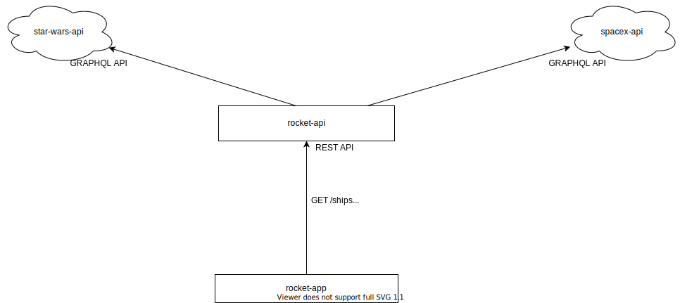

# iAdvize Workshop - 2021

You'll find in this repository an application that aggregates two external APIs : 
- [swapi](https://swapi-graphql.netlify.app/)
- [spacex-api](https://api.spacex.land/graphql/)

It exposes these to APIs in a single REST HTTP API (rocket-api).

This REST API is then consumed by a frontend application (rocket-app), allowing a human user to interact with it in a conversational way.



## back

### technical stack
- [scala](https://www.scala-lang.org/)
- [Play Framework](https://www.playframework.com/)
- [Caliban](https://ghostdogpr.github.io/caliban/)
- [ScalaTest](https://www.scalatest.org/) 

## front

### technical stack
- [TypeScript](https://www.typescriptlang.org/)
- [React](https://reactjs.org/)
- [fp-ts](https://gcanti.github.io/fp-ts/)
- [io-ts](https://gcanti.github.io/io-ts/)

### How to compile & run

- This will build & run the 2 apps (rocket-api and rocket-app)
- The front application will be available on [http://localhost:3000](http://localhost:3000)
- The API can be requested on [http://localhost:9000](http://localhost:9000)

```shell
docker-compose up
```

- In order to build & launch only the front, or only the back, you can rely on the `./docker-[build|run].sh` scripts located respectively on [./IAdvizeRocketBackEnd](IAdvizeRocketBackEnd) and [./IAdvizeRocketFrontEnd](IAdvizeRocketFrontEnd) 
